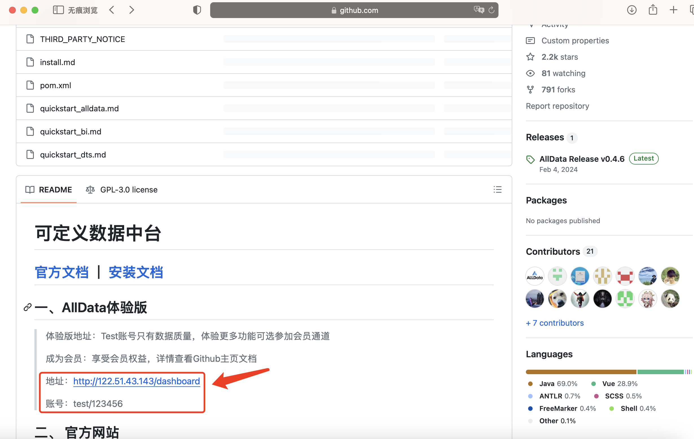
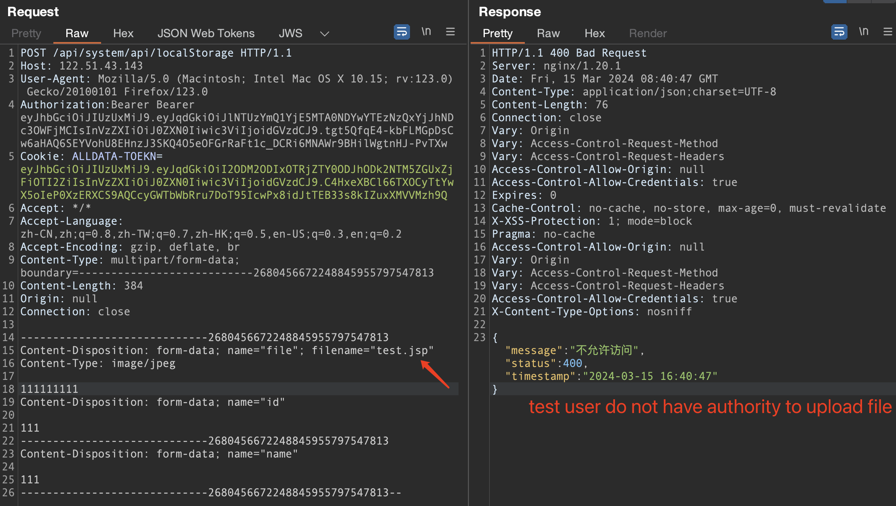
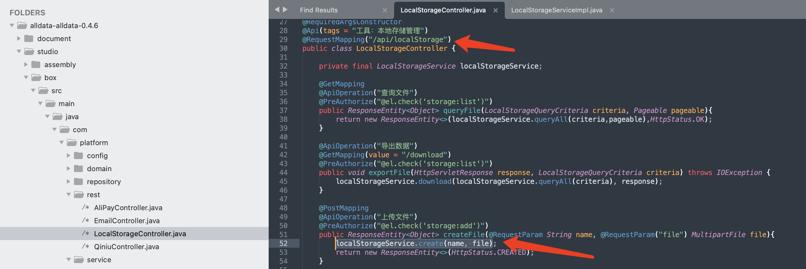
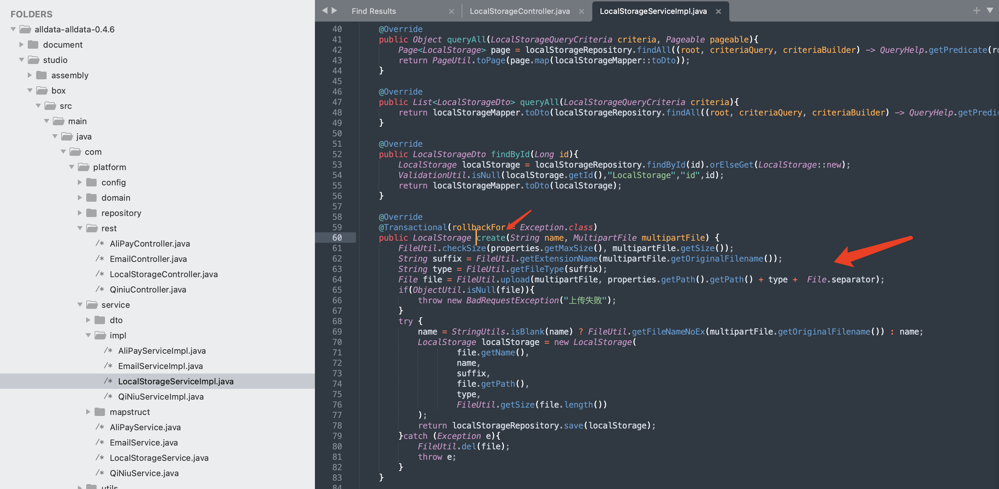
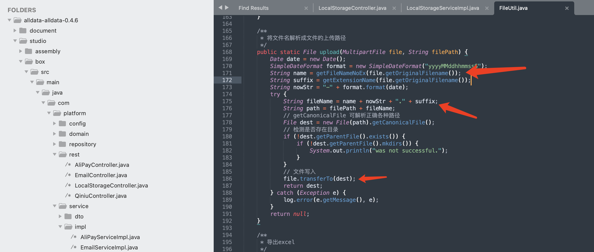
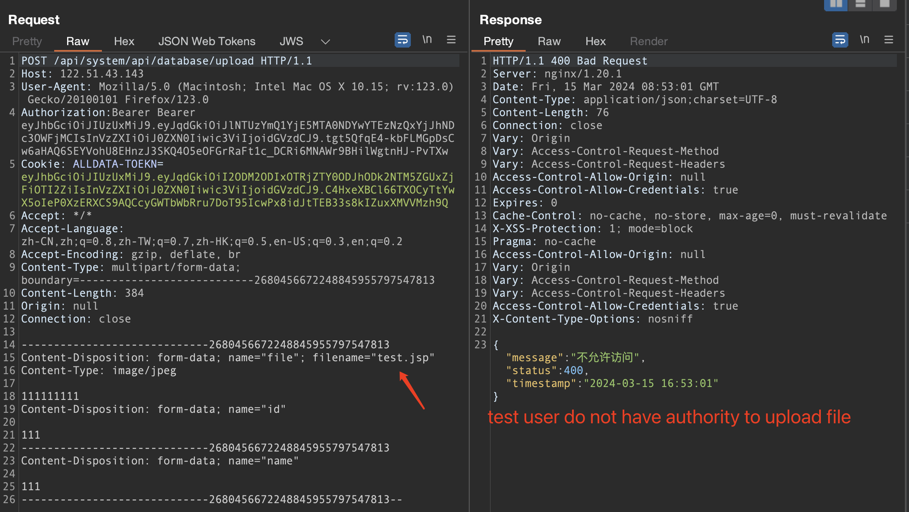
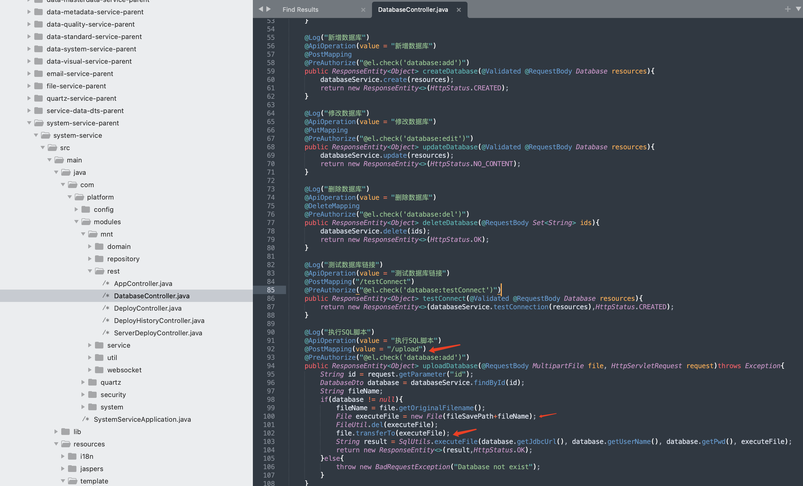
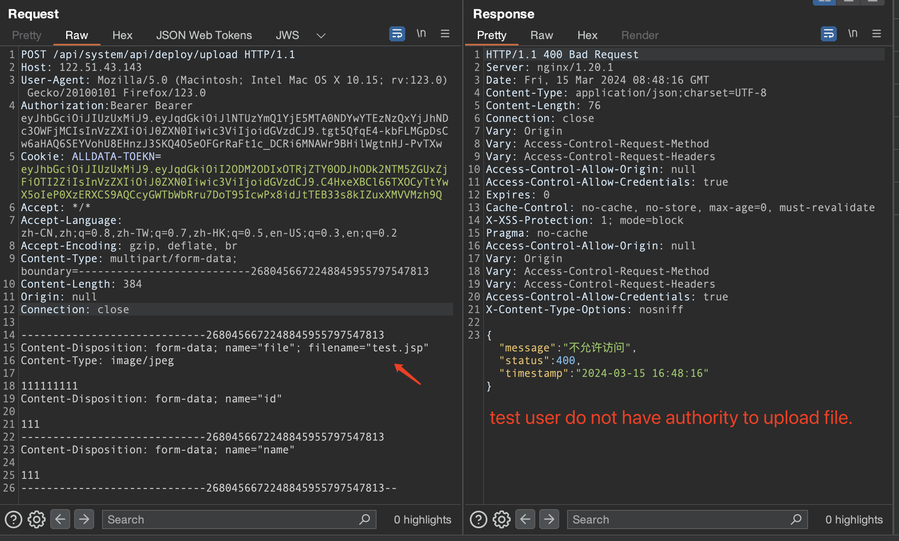
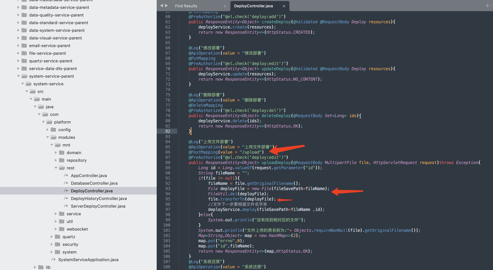

# About Alldata

​	AllData Big Data products are definable data middleware, providing full-link digital solutions with a data platform as the base, a data middleware as the bridge, a machine learning platform as the mid-layer framework, and a big model application as the upstream product.

## vulnerabilities

I found three vulnerabilities in the Alldata project.The vulnerability verification used uses the official demonstration environment, with the environment address and test username and password as follows:

URL:http://122.51.43.143/dashboard

user/pwd:test/123456

### 01-Any file upload 1

​	The system did not detect or restrict uploaded files. Attackers can upload Trojan files such as JSP to gain server privileges by adding/ Save files to any directory

URL：http://122.51.43.143/api/system/api/localStorage

test user do not have authority.

Filepath：/alldata-alldata-0.4.6/studio/box/src/main/java/com/platform/rest/LocalStorageController.java

Line number：52

Description：The LocalStorageController class hands over the uploaded files to the create method of the localStorageService class for processing

Filepath：/alldata-alldata-0.4.6/studio/box/src/main/java/com/platform/service/impl/LocalStorageServiceImpl.java

Line number：64

Description：The LocalStorageServiceImpl class hands over the uploaded file to the FileUtil class's upload method for processing

Filepath：/alldata-alldata-0.4.6/studio/generic/src/main/java/com/platform/utils/FileUtil.java

Line number：171-186

Description：In the FileUtil class upload method, the program concatenates the original file into the path of the file to be saved, and finally uses the transferTo method to write the file to the server. This shows that attackers can ../ Save the uploaded file to any location on the server

### 02-Any file upload 2

​	The system did not detect or restrict the types of files uploaded on the SQL file upload interface. Attackers can upload Trojan files such as JSP and use ../ Save files to any directory to gain server privileges
URL:http://122.51.43.143/api/system/api/database/upload
test user do not have authority to upload file.

Filepath：/alldata-alldata-0.4.6/studio/services/system-service-parent/system-service/src/main/java/com/platform/modules/mnt/rest/DatabaseController.java

Line number：94-102

Description：The DatabaseController class did not detect the uploaded file and directly wrote the uploaded file through the transferTo method

### 03-Any file upload 3

​	The system did not detect or restrict the types of files uploaded on the file upload interface. Attackers can upload Trojan files such as JSP file and use ../ Save files to any directory to gain server privileges.
URL:http://122.51.43.143/api/system/api/deploy/upload
test user do not have authority to upload file.

Filepath：/alldata-alldata-0.4.6/studio/services/system-service-parent/system-service/src/main/java/com/platform/modules/mnt/rest/DeployController.java

Line number：88-95

Description：The DeployController class did not detect the uploaded file and directly wrote the uploaded file through the transferTo method

